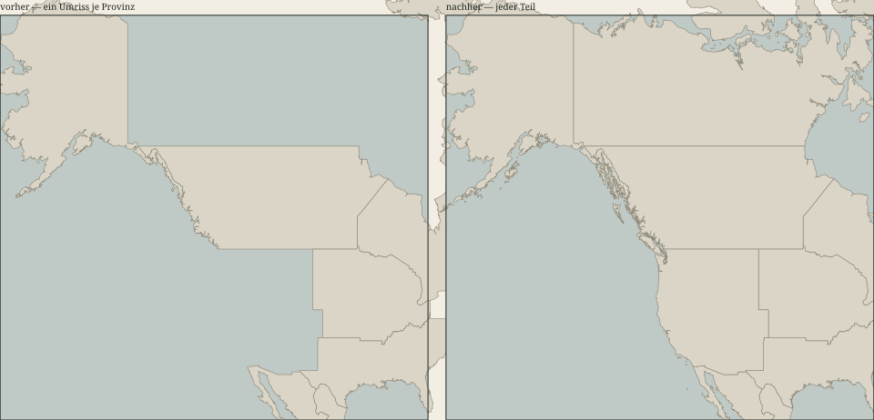
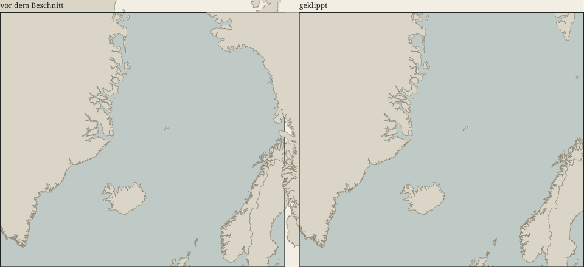

# Kartengeometrie — was die Karte zeigt und was da ist

Gemessen am **2026-09-07**, vorher gegen `0753329`, nachher gegen `cbf5877` (M19), von
`packages/mapgen/src/worldmap.geometry.test.ts`.

> Dieser Bericht gilt für genau diesen Stand. Zeigt `git log --oneline -1` etwas anderes,
> ist er überholt und keine Aussage über das Projekt.

## Das Ergebnis in einem Bild



Links, was das Spiel bis zum 2026-09-07 gezeichnet hat: Alaska ist da, und wo Kalifornien,
Oregon und Washington sein müssten, ist Meer. Rechts derselbe Ausschnitt danach.

**Dieses Bild ist der eigentliche Nachweis.** Vier grüne Zahlen belegen nicht, dass Noah
Kalifornien sieht — der gemeldete Fehler war ein sichtbarer, also gehört ein sichtbarer
Beleg dazu. Beide Hälften sind aus den Kartendateien selbst gezeichnet
(`node scripts/map-figure.mjs`), nicht abfotografiert: ein Screenshot lässt sich nicht
vergleichen, und niemand weiß ein Jahr später, aus welchem Stand er kam.

## Warum es diese Messung gibt

Am 2026-09-07 fiel im Playtest auf, dass Kalifornien nicht auf der Karte ist. Die Prüfkette
war zu diesem Zeitpunkt vollständig grün — 1400 Tests, `pnpm verify` ohne Befund, ein
Abnahmelauf mit 7 von 7.

Der Grund ist keine schlechte Prüfung, sondern eine fehlende: `worldmap.test.ts` prüft, ob
`world.json` eine **gültige** Karte ist — jede Kante indiziert, jede Hauptstadt echt, nichts
unerreichbar. Eine Provinz mit dem falschen Umriss ist eine gültige Provinz. Was nie geprüft
wurde, ist das Einzige, was der Spieler sieht: **liegt das Land, das die Quelle kennt,
tatsächlich auf der Leinwand.**

`data/maps/world-shapes.json` — die Quelle — war die ganze Zeit vollständig und richtig. Der
Fehler entstand erst beim Erzeugen von `world.json`: der Generator nahm je Provinz **einen**
Umriss und musste deshalb wählen.

> **Ein Eintrag in `PROBLEME.md` hat den Fehler vier Tage lang gedeckt.** Am 2026-09-03 stand
> dort über genau diese vier Provinzen: „Die Karte zeichnet richtig." Das war für
> `world-shapes.json` wahr und für `world.json` falsch, und der Satz sagte nicht, welche er
> meinte. Er ist am 2026-09-07 an Ort und Stelle berichtigt. **Sobald es zwei Dateien gibt,
> muss eine Aussage über „die Karte" sagen, welche sie meint.**

## Die vier Prüfungen — vorher und nachher

Alle vier vergleichen `world.json` gegen `world-shapes.json` durch **dieselbe** Projektion,
die der Generator benutzt (`packages/mapgen/src/project.ts`). Sie zu kopieren wäre der Fehler,
den die Prüfung finden soll: ein Wächter mit eigener Projektion kann nicht auffallen, wenn die
Projektion das Falsche ist.

| | prüft | vorher | nachher |
|---|---|---|---|
| **G1** | Der Ankerpunkt liegt in der eigenen gezeichneten Fläche | **14 von 237 fallen** | **0** |
| **G2** | Je Provinz sind ≥ 99 % der Quellfläche gezeichnet | **66 von 237 fallen** | **0** |
| **G3** | 35 bekannte Städte liegen auf ihrer eigenen Provinz | **3 von 35 fallen** | **0** |
| **G4** | Kein Punkt außerhalb `[0,4000] × [0,2400]` | **1 fällt** (Grönland) | **0** |

**Die Landfläche der Welt: 85,78 % → 100,00 %.** Alle Übergangslisten sind leer, und keine
Schwelle wurde weicher.

| | vorher | nachher |
|---|---|---|
| Umrisse in `world.json` | 237 | **2070** |
| Punkte | 69 042 | **93 402** |
| Provinzen, die Land verlieren | 130 | 0 |
| Punkte neben der Leinwand | 4087¹ | **0** |

¹ nach T-M19-02 und vor T-M19-03; vor beidem waren es 796, alle in Grönland.

### G1 — der Ankerpunkt

`center` trägt die Armeemarke und die Beschriftung. Liegt er außerhalb der eigenen Fläche,
steht Norwegens Armee in der Nordsee. Betroffen waren `CAN-NORTH`, `FJI`, `GRC`, `HRV`, `HTI`,
`MEX-SE`, `NOR`, `NZL`, `PHL`, `SGP`, `SWE`, `THA`, `USA-WEST`, `VNM`.

Zwei Ursachen, beide behoben. Bei fünf fehlte die Fläche, in der der Anker liegt — das erledigt
T-M19-02 mit. Bei den übrigen **neun war der Anker selbst falsch gerechnet**: `shapeCentre`
mittelt die Randpunkte des größten Rings, und bei einer konkaven Küste wie Norwegens liegt
dieser Mittelwert im Wasser. Der Anker ist jetzt die **Mitte der längsten waagerechten Sehne**
— innen von der Konstruktion her, denn eine Sehne zwischen zwei Durchstoßpunkten liegt in der
Fläche. Verschoben wurde er nur dort, wo er nicht funktionierte: **9 von 237**.

### G2 — die gezeichnete Fläche

Die eigentliche Zahl des Befundes, gemessen mit der Schnürsenkelformel über die **projizierten**
Koordinaten, damit Quelle und Zeichnung im selben Maß stehen.

| Schwelle | vorher darunter | nachher |
|---|---|---|
| 100 % (verlieren überhaupt etwas) | **130** | 0 |
| 99,9 % | 106 | 0 |
| **99 %** (die geprüfte Schwelle) | **66** | **0** |
| 95 % | 37 | 0 |
| 90 % | 24 | 0 |

Die schlimmsten Fälle vorher:

| Provinz | gezeichnet | Ringe in der Quelle |
|---|---|---|
| `CAN-NORTH` | 11,6 % | 248 |
| `FJI` | 31,3 % | 44 |
| `PHL` | 37,6 % | 99 |
| `NZL` | 38,5 % | 26 |
| `JPN-SOUTH` | 44,7 % | 72 |
| `NOR` | 47,9 % | 120 |
| `USA-WEST` | 58,0 % | 218 |

Alle 94 Provinzen, deren Quellgeometrie ein einfaches `Polygon` ist, zeichneten schon vorher
100 %. Es fiel **ausschließlich**, was in der Quelle aus mehreren Teilen besteht — 143
Provinzen. Das ist der Beleg, dass die Ursache die Auswahl war und nicht die Vereinfachung.

> **Die Falle, die den Fehler so lange getragen hat:** „nimm den größten Ring" wählt für
> `USA-WEST` **Alaska**. Mercator bläht hohe Breiten mit 1/cos²(φ) auf — Alaska misst
> projiziert 84 453 px² gegen 58 147 px² der Weststaaten, bei echter Fläche aber 268 gegen 329
> Grad². Jede Reparatur, die weiter *auswählt*, wählt wieder falsch. Deshalb wird jetzt nicht
> besser gewählt, sondern **gar nicht mehr**.

#### Die Filterschwelle — und warum sie nicht die aus dem Bauplan ist

Der Bauplan schlägt vor, Ringe unter **25 px²** zu verwerfen, und nennt dafür 99,79 % der
Fläche bei +26 % Punkten. Beide Zahlen stimmen — und mit ihnen wäre G2 **nie grün geworden**:

| Schwelle | Ringe | Punkte | Fläche | Provinzen unter 99 % |
|---|---|---|---|---|
| **> 0 px²** | 2165 | 97 463 (+41 %) | **100,000 %** | **0** |
| 1 px² | 1942 | 96 510 | 99,997 % | 2 |
| 5 px² | 1094 | 91 816 | 99,943 % | 19 |
| 25 px² (Bauplan) | 585 | 87 093 (+26 %) | 99,788 % | **38** |

Die beiden Zusagen derselben Aufgabe — „mindestens 99 % je Provinz" und „+26 % Punkte" — sind
unvereinbar. Es gilt die Fertig-Bedingung.

Verworfen wird deshalb genau, was **nach dem Runden auf ganze Bildpunkte keine Fläche mehr
hat**: 1228 der 3393 Außenringe. Sie sind eine Linie oder ein Punkt, eine Füllung über ihnen
bedeckt nichts, und sie wegzulassen kostet **0,000 %** des Landes bei 4934 gesparten Punkten.
Das ist keine Geschmacksfrage, sondern eine Aussage über die Auflösung der Leinwand.

### G3 — bekannte Städte

35 Städte über alle Kontinente, `data/maps/landmarks.csv`. Geprüft wird nicht „liegt irgendwo
an Land" — das wäre zu schwach, eine Stadt, die in die Nachbarprovinz rutscht, käme durch.
Geprüft wird: **die Stadt liegt auf der gezeichneten Fläche der Provinz, in der die Quelle sie
führt.** Vorher fielen **Los Angeles** (`USA-WEST`), **Tokio** (`JPN-CENTRAL`) und **Singapur**
(`IDN-SUM`); nachher keine.

Toleranz 5 px, und sie ist nötig, nicht bequem: die Küstenlinie der Quelle ist bereits
vereinfacht (Visvalingam, 0,002 Grad²), und New York liegt dadurch 0,9 px vor dem gezeichneten
Ufer. Fünf Bildpunkte auf 4000 sind 0,125 % der Breite — zu wenig, um eine fehlende Landmasse
zu verdecken.

### G4 — die Leinwand



Grönland reichte mit 796 Punkten über den oberen Rand, bis `y = −436`. Der 78°-Beschnitt legt
den Ausschnitt fest, aber nichts klippte gegen ihn. **Nach T-M19-02 wurde es schlimmer**, und
das war die Reparatur bei der Arbeit: solange nur der punktreichste Ring gezeichnet wurde, lag
das meiste oberhalb des Schnitts gar nicht in der Datei. Mit allen Teilen kamen die arktischen
Inseln Kanadas, Norwegens und Russlands dazu — 4087 Punkte neben dem Bild.

Geklippt wird jetzt mit **Sutherland–Hodgman**. Der naheliegende Weg wäre falsch gewesen:
`y = Math.max(0, y)` legt die ganze Nordküste auf eine gerade Linie. Das ist messbar, und
deshalb hat es einen Test — der **Anteil der Punkte, die genau auf der Kante liegen**:

| | richtig geklippt | zusammengefaltet |
|---|---|---|
| Grönland | 7 von 3497 (0,2 %) | alle 796 |
| `CAN-NORTH` | 18 von 7768 (0,2 %) | 1089 von 8839 (12,3 %) |

Der Wächter zieht die Grenze bei 10 % und wurde gegen die falsche Fassung geprüft: er fällt.

**Die Alternative aus dem Bauplan ist gemessen und verworfen.** Den Beschnitt nach Norden zu
schieben lässt bei 83,7° alles hineinpassen, senkt aber die Skala von **11,96 auf 10,00
Bildpunkte je Grad**: die ganze Welt 16 % kleiner, damit 4 % davon sichtbar werden, und alle
237 Ankerpunkte verschieben sich.

## Das Bildbudget

**16,7 ms bei p95** ist die Anforderung (R-ARCH-06/AK2, ein Bild bei 60 Hz). Gemessen an
derselben Funktion gegen beide Datenstände, Node, ruhige Maschine, 200 Bilder je Fall:

| Fall | Formen vorher | Formen nachher | p95 vorher | p95 nachher |
|---|---|---|---|---|
| Weltansicht | 235 | 901 | 2,08 ms | **2,95 ms** |
| Nah heran | 203 | 1239 | 1,57 ms | **3,11 ms** |
| Rohstoffe | 235 | 901 | 2,41 ms | **2,55 ms** |

Der Abstand zum Budget bleibt Faktor fünf. Dass er das tut, ist allerdings **nicht umsonst**:
die erste Fassung zeichnete 2070 Formen statt 901, und im Browser — an einem echten 2D-Kontext
mit echtem Zeichnen — stieg p95 dort von 13,5 auf 22,5 ms. Ein Umriss, dessen längere Seite auf
dem Schirm unter 1,5 px fällt, bekommt seither keinen Pfad (`worthDrawing`); das ist dasselbe
Maß, das `thin` schon für einzelne Punkte benutzt.

> **Zur Ehrlichkeit dieser Zahlen:** dieselbe Vorher-Fassung liefert im Browser dieser Sitzung
> p95 13,5 ms, in der Messung von T-M16-06 aber 3,0 ms. Die Umgebung hier ist vier- bis
> siebenmal langsamer und schwankt zwischen Läufen um mehr, als der gemessene Effekt groß ist.
> **Belastbar ist deshalb nur der relative Vergleich**; die absoluten Zahlen oben sind die aus
> Node. `docs/reports/render-bench.json` bleibt die Messung von T-M16-06 und gilt für deren
> Stand.

Und der Filter hatte prompt die **Gegenrichtung** desselben Fehlers: Malta und Singapur sind
bei Weltansicht unter einem Bildpunkt breit, jeder ihrer Umrisse fiel durch die Schwelle, und
beide Provinzen verschwanden von der Karte. Eine Provinz, die der Spieler besitzt und nicht
sieht, ist genau dieser Befund von der anderen Seite. Jede Provinz zeichnet jetzt mindestens
ihren größten Umriss, egal wie klein er ist.

## Anklickbarkeit

Die Karte zu zeichnen ist die eine Hälfte; sie zu treffen die andere. `AUS-SE` war auf **5 von
43 px²** anklickbar — und diese fünf lagen auf der Macquarie-Insel, 331 Bildpunkte südlich des
Festlands, weil ihre beiden Festlandsteile in `AUS-NE` liegen und `pickProvince` den ersten
Treffer nahm.

Bei zwei Umrissen über demselben Punkt gewinnt seither der **kleinere**. Genau **1 von 196 196**
Rasterpunkten der Karte ist doppelt beansprucht, die Regel greift also fast nie — und wenn,
dann bei einer Enklave. Der Wächter prüft dazu nicht die Größe einer Provinz, sondern dass
**ihr Ankerpunkt sie auswählt**; ein Größenwächter hätte Singapur (4 px²), Bahrain (5), Malta
(6) und Hongkong (13) gemeldet und `AUS-SE` (43) durchgelassen.

## Dass die Prüfungen beißen, ist nachgewiesen

Ein Test, der nach der Reparatur geschrieben wird, hat nie bewiesen, dass er den Fehler findet.
Jede dieser Prüfungen wurde einzeln zum Fallen gebracht, indem die Reparatur weggenommen wurde:

| Prüfung | Meldung |
|---|---|
| G1 | `Ankerpunkt ausserhalb der eigenen Flaeche: USA-WEST` |
| G2 | `zeichnen weniger als 99 % ihrer Quellflaeche: USA-WEST 58.0 %` |
| G3 | `Singapur liegt nicht auf der gezeichneten Flaeche von IDN-SUM` |
| G4, Gegenrichtung | `Diese Provinzen stehen auf der Uebergangsliste, sind aber heil: DEU-NE` |
| Beschnitt | `CAN-NORTH: 1089 von 8839 Punkten liegen genau auf der Leinwandkante` |
| Anker | `expected [ 80, 50 ] to not deeply equal [ 80, 50 ]` |
| Klick | `AUS-SE -> AUS-NE` |
| Klick auf Kalifornien | `expected null to be 'USA-WEST'` |
| Kein Verschwinden | `auf der Weltkarte nicht gezeichnet: MLT, SGP` |

## Was offen bleibt

**Der Name `AUS-SE`.** „Südostaustralien" besteht aus dem Hauptstadtterritorium, Jervis Bay und
der Macquarie-Insel; Victoria und New South Wales stecken in `AUS-NE`. Das ist ein
Kuratierungsfehler in `world-provinces.csv`, und ihn zu beheben hieße, `pnpm map:build` mit den
Geodaten laufen zu lassen — was die Anreicherung neu ausführt und damit Bevölkerung, Gelände
und Vorkommen aller 237 Provinzen. Eine Namenskorrektur würde die Partie neu würfeln. Die drei
Möglichkeiten stehen mit Empfehlung in `PROBLEME.md`, 2026-09-07; **die Entscheidung liegt bei
Noah.**

## Wie die Zahlen dieses Berichts entstehen

```bash
npx vitest run packages/mapgen/src/worldmap.geometry.test.ts
```

```bash
node scripts/reproject-map.mjs --check
```

Das zweite meldet, ob `world.json` noch dem entspricht, was die Quelle ergibt — es ist der
Beleg, dass die Datei nicht von Hand berührt wurde.
